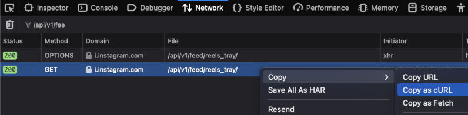

# Likeur - UI helper for [Instagram](https://www.instagram.com/)

# How to Use
**! At you own risk, though.**
1. Copy a request in the cURL format: 
1. Setup a HTTP proxy (coz browser JS cannot use custom Cookie header to authenticate instagram requests). You may use pipedream.com as a free proxy (here's [the script](pipedream.proxy.js)).
1. Add some Places via the "Show Places" dialog and click Update buttons to fetch the feeds (this may take up to minute or two).
1. Refresh the page and filter posts. All your decision are stored in IndexedDB in your browser and used to filter out candidates in future.
